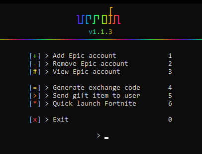

# verofn

epic account helper — add accounts, grab exchange codes, send gifts, launch fortnite.



## setup

```bash
pip install colorama requests
python vero.py
```

accounts live in `config.json` (starts empty). add them from the menu.

## menu

| | |
|:--|:--|
| **1** | add epic account |
| **2** | remove epic account |
| **3** | view epic accounts |
| **4** | generate exchange code |
| **5** | send gift to a user |
| **6** | quick launch fortnite |
| **0** | exit |

---

made for personal use — don't commit real device auth secrets
